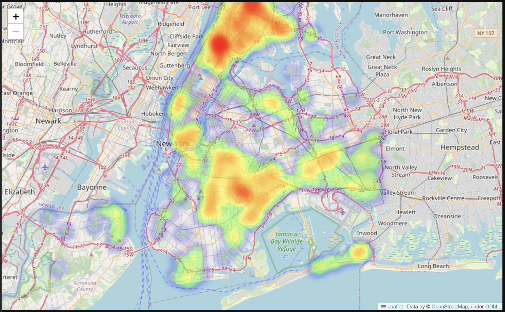

# NYPD Shooting Incident Project

This project analyzes shooting incidents in New York City using the NYPD dataset.
The notebook covers data wrangling, handling missing values, outliers, transformations, EDA, correlations, and visualizations.

## 📓 Notebook
👉 [Open on nbviewer](https://nbviewer.org/url/raw.githubusercontent.com/adirbella37/NYPD-Shooting-Incident-Project/main/NYPD_Shooting_Incident_Project.ipynb)

## 🌍 Interactive Map


👉 [Open Interactive Heatmap](https://adirbella37.github.io/NYPD-Shooting-Incident-Project/heatmap.html)

## ⚙️ Technologies
- Python 
- Pandas — data wrangling & preprocessing
- Matplotlib & Seaborn — charts and visualizations
- Folium — interactive heatmap

## 📂 Project Structure

| File/Folder   | Description                                  |
|---------------|----------------------------------------------|
| `NYPD_Shooting_Incident_Project.ipynb` | Main Jupyter Notebook with the full analysis |
| `data.csv`    | Dataset used for the project                 |
| `docs/`       | Contains the interactive heatmap (`heatmap.html`) |
| `images/`     | Contains images and previews used in the project |
| `README.md`   | Project documentation                        |


## ▶️ How to run

You can get this project in two ways:

**Option 1 – Using Git**

```bash
git clone https://github.com/adirbella37/NYPD-Shooting-Incident-Project.git
cd NYPD-Shooting-Incident-Project
```


**Option 2 – Download as ZIP**

  1. Click the green Code button at the top of this repository
  2. Select Download ZIP
  3. Extract the ZIP file on your computer

## 📈 Key Insights
- Contrary to expectations, shooting incidents are almost evenly split between day and night.  
- Incident rates rise steadily at the beginning of the year, peak in July, and then decline — likely due to targeted police intervention in Brooklyn.  
- Surprisingly, around 70% of outdoor incidents involve older age groups, despite the assumption that they would exercise more discretion.  


## 📜 License
This project is licensed under the MIT License.

